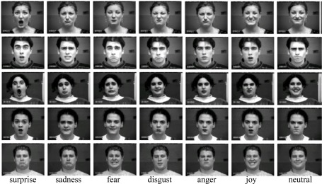

# Facial-Emotion-Recognition
Metis Project #3 - Image classification with neural networks 

We used OpenCV and convolutional neural networks to classify images of faces based on emotion. The dataset is over 30,000 grayscale 48x48 pixel images of faces. There are seven different labels for emotions (0=Angry, 1=Disgust, 2=Fear, 3=Happy, 4=Sad, 5=Surprise, 6=Neutral). Data source is the Facial Expression Recognition challenge on [Kaggle](https://www.kaggle.com/c/challenges-in-representation-learning-facial-expression-recognition-challenge/data). A presentation for this project can be found [here.](Facial Emotion Recognition.pdf)

Neural Network code is based on the official Tensorflow tutorial code for [CIFAR-10](https://github.com/tensorflow/tensorflow/tree/r0.11/tensorflow/models/image/cifar10/). It has been adjusted to work on the FER2013 dataset and to make better use of GPU. Also fixed some errors caused by the Tensorflow version update to v11.0, so this code should run on v11.0 but may not be future-proof. Instructions can be found in the Neural Network [folder](Neural Network). 

